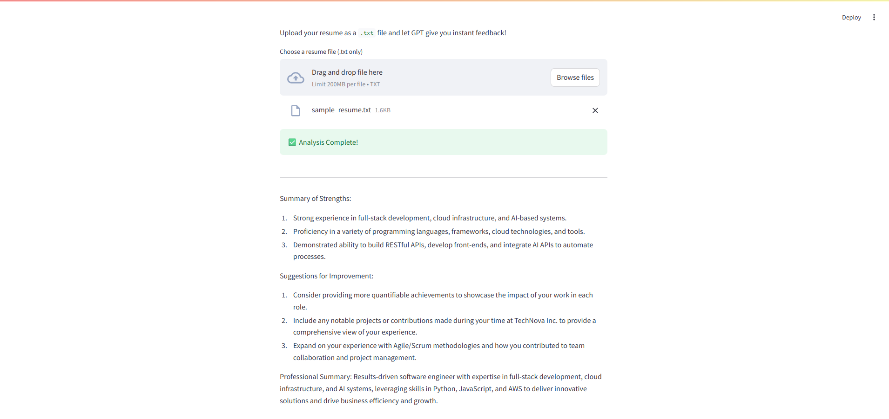

# 🧠 AI Resume Analyzer

Upload your resume as a `.txt` file and receive instant AI-powered feedback using GPT via a sleek Streamlit web app.

## 🚀 Features

- Upload a plain text resume
- GPT analyzes and returns:
  - ✅ Key strengths
  - 🛠 Suggestions for improvement
  - ✍️ A 1-sentence professional summary
- Built with Python, Streamlit, and OpenAI's GPT-3.5 API

## 🖥 Demo



## 📂 Files

- `app.py`: Streamlit GUI
- `main.py`: Core logic for reading and analyzing the resume
- `config.py`: API key (excluded from repo via `.gitignore`)
- `requirements.txt`: Dependency list
- `sample_resume.txt`: Sample input resume

## ⚙️ How to Run Locally

1. Clone the repo  
   `git clone https://github.com/CyrusHurley/resume-analyzer.git`

2. Navigate into the project  
   `cd resume-analyzer`

3. Create a virtual environment (optional but recommended)  
   `python -m venv .venv`  
   `source .venv/Scripts/activate` (Windows)

4. Install dependencies  
   `pip install -r requirements.txt`

5. Add your OpenAI key to `config.py`

6. Launch the app  
   `streamlit run app.py`

## 🔐 Note
Your `config.py` file should define:
```python
OPENAI_API_KEY = "your_openai_api_key"

```


## 📄 License

MIT License

---

Made with ❤️ by [Cyrus Hurley](https://github.com/CyrusHurley)

